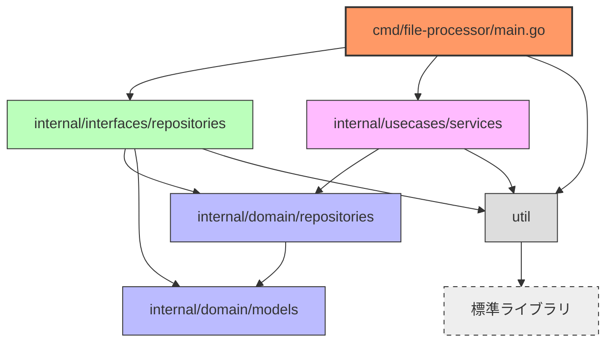

# devbox


Provides utilities for development.

# Usage
- Go 1.23.5 or later

# Development

## Build
```bash
./scripts/build.sh
```

Confirm compilable distributions.
```bash
go tool dist list
```

## Project Structure

`devbox` is based on Clean Architecture. That package dependencies are the following.



### Package Overview

- **cmd/file-processor/main.go**: アプリケーションのエントリーポイント。コマンドライン引数の解析と依存関係の注入を行います。
- **internal/domain/models**: ドメインモデル（`FileContent`）の定義。ファイル内容の操作に関するビジネスロジックを実装しています。
- **internal/domain/repositories**: リポジトリインターフェース（`FileRepository`）の定義。ファイルの読み書きを抽象化します。
- **internal/interfaces/repositories**: リポジトリの実装（`FileRepositoryImpl`）。実際のファイルシステムとのやり取りを担当します。
- **internal/usecases/services**: ユースケース（`FileService`）の実装。ドメインモデルとリポジトリを組み合わせてビジネスロジックを実行します。
- **util**: ロギングやユーティリティ機能を提供します。アプリケーション全体で使用される共通機能です。

# License
MIT License
