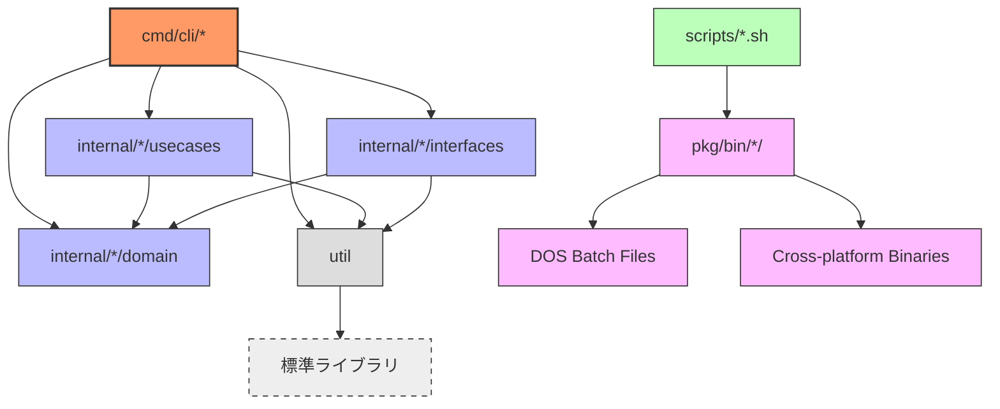

# devbox


Provides utilities for development.

# Usage
- Go 1.23.5 or later

# Development

## Generate Go packages
```bash
./scripts/create_project_files.sh <PACKAGE_NAME>
```

## Generate shell scripts to build
```bash
cd devbox
./pkg/bin/cli/linux_amd64/script-generator-to-build <TOOL_NAME>
```

# Build

## Common Tools
```bash
./scripts/build.sh
```

Confirm compilable distributions.
```bash
go tool dist list
```

## MCP Tools
```bash
./scripts/build_mcp_tools.sh
```

## Git Hooks
Set Git hooks with built binary files
```bash
./scripts/setup-git-pre-commit-hooks.sh
```

## RESTful API
```bash
go run ./cmd/http/main.go
```

## gRPC API
```bash
go run ./cmd/grpc/main.go
```

# Project Structure

`devbox`は複数のCLIツールを提供する開発ユーティリティ集合体です。Clean Architectureに基づいて設計されており、以下のパッケージ依存関係を持ちます。



## Package Overview

- **cmd/**: 各CLIツールのエントリーポイント群。30以上のコマンドラインツールが含まれており、それぞれが独立したアプリケーションとして動作します。主要ツール例：
  - `file-processor`: ファイル処理ユーティリティ
  - `image-converter`: 画像形式変換ツール
  - `json-formatter-for-agent-interaction`: JSON整形ツール
  - `code-analyzer`: コード解析ツール
  - `depends-visualizer`: 依存関係可視化ツール

- **internal/**: 各ツールのビジネスロジック実装。Clean Architectureに従って以下の層に分離：
  - `domain/`: ドメインモデルとリポジトリインターフェース
  - `usecases/`: ビジネスロジックとユースケース実装
  - `interfaces/`: 外部システムとのインターフェース実装

- **pkg/**: ビルド成果物とデプロイメント用ファイル群：
  - `bin/`: クロスプラットフォーム対応のバイナリファイル（Linux、macOS、Windows）
  - `dos/`: Windows環境向けのバッチファイル群

- **scripts/**: ビルドとデプロイメント自動化スクリプト群。各ツールの個別ビルドスクリプトと統合ビルドスクリプトを提供します。

- **util/**: 全ツール共通のユーティリティ機能。ロギング、共通処理、ヘルパー関数を提供します。

# License
MIT License
