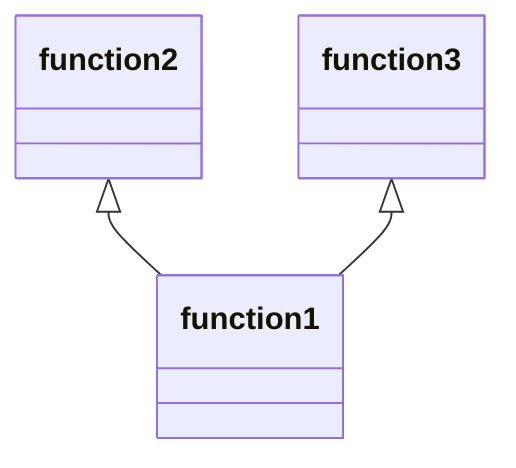

# 関数依存関係可視化ツール

プログラムファイル内の関数間の依存関係を解析して可視化するツールです。

## 概要

このツールは、Go、Python、JavaScriptなどのソースコードファイルを解析し、関数間の呼び出し関係をMermaid、PlantUML、DOT形式で可視化します。コードベースの理解やリファクタリング計画に役立ちます。

## インストール

```bash
go install github.com/yourusername/depends-visualizer@latest
```

または、リポジトリをクローンして手動でビルドすることもできます：

```bash
git clone https://github.com/yourusername/depends-visualizer.git
cd depends-visualizer
go build
```

## 使用方法

### コマンドラインオプション

以下のオプションを指定できます：

| オプション | 説明 | デフォルト値 |
|------------|------|------------|
| `-file`    | 解析対象のソースファイル | - |
| `-dir`     | 解析対象のディレクトリ | `.` |
| `-ext`     | ファイルの拡張子 (.go, .py, .js) | 自動検出 |
| `-format`  | 出力形式 (mermaid, mermaid-flowchart, plantuml, dot) | `mermaid` |
| `-out`     | 出力ファイルのパス | - (標準出力) |
| `-r`       | ディレクトリを再帰的に処理 | `false` |
| `-config`  | 設定ファイルのパス | - |
| `-v`       | 詳細なログを出力 | `false` |
| `-json-log`| ログをJSON形式で出力 | `false` |

## 使用例

### 単一ファイルの解析
```bash
depends-visualizer -file main.go
```

### ディレクトリ内のファイルを解析
```bash
depends-visualizer -dir ./src
```

### 出力形式を指定
```bash
depends-visualizer -file main.go -format plantuml
```

### 出力ファイルを指定
```bash
depends-visualizer -file main.go -out dependencies.md
```

### 再帰的にディレクトリを処理
```bash
depends-visualizer -dir ./src -r
```

## 出力形式

### Mermaid



### PlantUML

```
@startuml
function1 --> function2
function1 --> function3
@enduml
```

### DOT（Graphviz）

```
digraph G {
  rankdir=BT;
  node [shape=box, style=filled, fillcolor=lightblue];
  
  "function1" -> "function2";
  "function1" -> "function3";
}
```

## 設定ファイル

設定ファイルはJSON形式で、以下のような項目を指定できます：

```json
{
  "spaces": [" ", "\t"],
  "languages": {
    ".go": {
      "function_header": "func ",
      "function_tail": "(",
      "main_marker": "func main() {",
      "comment_prefix": "//",
      "multiline_comment": true
    },
    ".py": {
      "function_header": "def ",
      "function_tail": "(",
      "main_marker": "if __name__ == \"__main__\":",
      "comment_prefix": "#",
      "multiline_comment": true
    }
  },
  "output_format": "mermaid",
  "log_level": "info"
}
```

## サポートされる言語

デフォルトでは以下の言語をサポートしています：

- Go (`.go`)
- Python (`.py`)
- JavaScript (`.js`)

設定ファイルを使用して、他の言語のサポートを追加できます。

## 使用例

### Webアプリケーションのバックエンドコードの解析

```bash
depends-visualizer -dir ./backend -r -format mermaid -out backend-deps.md
```

これにより、バックエンドディレクトリ内のすべてのコードファイルを再帰的に解析し、関数間の依存関係をMermaid形式で`backend-deps.md`ファイルに出力します。

### 特定の言語ファイルのみを解析

```bash
depends-visualizer -dir ./src -ext .py -format dot -out python-deps.dot
```

これにより、`src`ディレクトリ内のPythonファイルのみを解析し、DOT形式で出力します。

## ライセンス

MIT

## 貢献

バグレポート、機能リクエスト、プルリクエストなど、あらゆる形の貢献を歓迎します。
