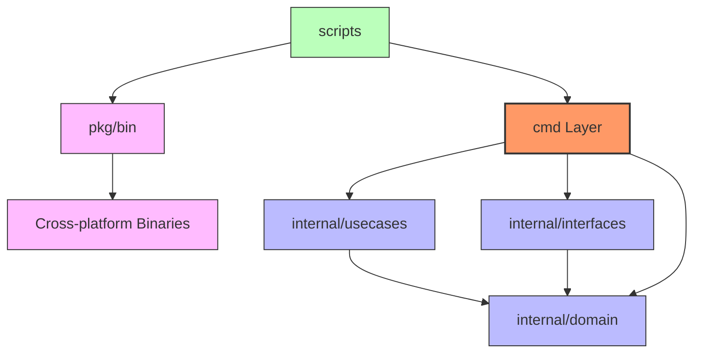
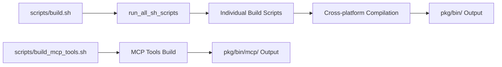

# devbox プロジェクト設計仕様書

## 1. プロジェクト概要

### 1.1 プロジェクトの目的
`devbox`は開発者向けの包括的なユーティリティツール集合体です。現在（2025年時点）で69個のCLIツールと22個のMCP（Model Context Protocol）サーバーを提供し、日常的な開発作業を効率化することを目的としています。

### 1.2 主要機能
- **CLIツール群**: ファイル処理、画像変換、データ変換、コード解析、クラウド連携など69のコマンドラインユーティリティ
- **MCPサーバー群**: AI開発環境との統合を可能にする22個の外部API連携サーバー
- **クロスプラットフォーム対応**: Linux、macOS、Windows環境での動作保証
- **自動化ビルドシステム**: 効率的な開発・デプロイメントワークフロー

### 1.3 技術スタック
- **言語**: Go
- **アーキテクチャ**: Clean Architecture
- **ビルドシステム**: Bash スクリプトベース
- **主要依存関係**:
  - MCP: `github.com/mark3labs/mcp-go`
  - 画像・動画処理: `github.com/anthonynsimon/bild`, `github.com/gen2brain/webp`, `github.com/gen2brain/avif`, `github.com/u2takey/ffmpeg-go`
  - 文書処理: `github.com/pdfcpu/pdfcpu`
  - データストア: `github.com/lib/pq`, `github.com/valkey-io/valkey-go`
  - 外部API/クラウド: `github.com/google/go-github`, `cloud.google.com/go/...`, `golang.org/x/oauth2`, `google.golang.org/api`, `google.golang.org/genai`
  - テスト: `github.com/stretchr/testify`, `github.com/DATA-DOG/go-sqlmock`

## 2. アーキテクチャ設計

### 2.1 設計思想
プロジェクトはClean Architectureの原則に基づいて設計されており、以下の特徴を持ちます：

- **関心の分離**: ビジネスロジック、インフラストラクチャ、プレゼンテーション層の明確な分離
- **依存関係の逆転**: 外部依存への抽象化によるテスタビリティの向上
- **単一責任原則**: 各コンポーネントが明確な責任を持つ設計
- **拡張性**: 新機能追加時の既存コードへの影響最小化

### 2.2 レイヤー構造



## 3. ディレクトリ構造詳細

### 3.1 cmd/ - エントリーポイント層
```
cmd/
├── cli/          # CLIツール群（69ツール、カテゴリ毎に整理）
│   ├── arithmetic-calculator/
│   ├── file-processor/
│   ├── image-converter/
│   ├── ops-for-golang/
│   ├── ocr-executor/
│   └── ...
├── grpc/         # gRPCサーバーエントリーポイント
│   └── main.go
├── http/         # RESTサーバーエントリーポイント
│   └── main.go
├── mcp/          # MCPサーバー群
│   ├── router.go # MCPサーバールーティング
│   ├── arithmetic_calculator/
│   ├── brave_search/
│   ├── github/
│   └── ...
└── powershell/   # Windows PowerShell スクリプト
```

**責任範囲**:
- コマンドライン引数の解析
- 設定の初期化
- ユースケース層への処理委譲
- エラーハンドリングと出力制御
- HTTP/gRPCサービスの起動とハンドラ登録

### 3.2 internal/ - ビジネスロジック層
```
internal/
├── {tool_name}/
│   ├── domain/      # ドメインモデル・エンティティ
│   ├── usecases/    # ビジネスロジック・ユースケース
│   └── interfaces/  # 外部システムインターフェース
```

**各サブレイヤーの責任**:
- **domain/**: ビジネスルール、エンティティ、リポジトリインターフェース
- **usecases/**: アプリケーション固有のビジネスロジック
- **interfaces/**: 外部API、データベース、ファイルシステムとの連携

### 3.3 pkg/ - ビルド成果物管理
```
pkg/
├── bin/          # 実行可能バイナリ
│   ├── cli/      # CLIツールバイナリ
│   │   ├── linux_amd64/
│   │   ├── darwin_arm64/
│   │   └── win_amd64/
│   └── mcp/      # MCPサーバーバイナリ
│       ├── linux_amd64/
│       ├── darwin_arm64/
│       └── win_amd64/
├── bash/         # ビルド済みのBashユーティリティ
└── dos/          # Windows バッチファイル
```

**管理対象**:
- クロスプラットフォーム対応バイナリファイル
- Windows環境向けDOSバッチファイル
- デプロイメント用パッケージ

### 3.4 scripts/ - ビルド自動化
```
scripts/
├── build.sh                    # メインビルドスクリプト
├── build_mcp_tools.sh         # MCPツール専用ビルド
├── create_project_files.sh    # プロジェクト雛形生成
└── build_{tool_name}.sh       # 個別ツールビルド
```

**機能**:
- 統合ビルドプロセスの自動化
- クロスプラットフォームコンパイル
- 依存関係管理
- テスト実行とカバレッジ計測

## 4. MCPサーバーシステム

### 4.1 アーキテクチャ概要
MCPサーバーシステムは`cmd/mcp/router.go`を中心とした統一的なルーティングシステムを採用しています。

```go
// router.goの主要構造
func Router() {
  args := os.Args
  switch args[1] {
  case "arith_calc":
      arithmetic_calculator.BuildArithCalculatorServer()
  case "github":
      github.BuildGitHubServer()
  // ... その他のサーバー定義
  }
}
```

### 4.2 提供MCPサーバー一覧

[service_implementation_status.md](./service_implementation_status.md)を参照。

### 4.3 拡張パターン
新しいMCPサーバーを追加する際の標準的な手順：

1. `cmd/mcp/{server_name}/` ディレクトリ作成
2. `internal/{server_name}/` でビジネスロジック実装
3. `router.go` にルーティング追加
4. `scripts/build_{server_name}.sh` ビルドスクリプト作成

## 5. ビルドシステム

### 5.1 ビルドフロー概要


### 5.2 主要ビルドスクリプト

**build.sh**
- 全ビルドスクリプトの統合実行
- エラーハンドリングと実行結果レポート
- スキップ機能による柔軟な実行制御

**build_mcp_tools.sh**
- MCPツール専用のクロスプラットフォームビルド
- Linux/AMD64、macOS/ARM64、Windows/AMD64対応
- バイナリサイズ最適化（`-ldflags="-s -w" -trimpath`）

### 5.3 クロスプラットフォーム対応
```bash
# 例: MCPツールのマルチプラットフォームビルド
GOOS=linux GOARCH=amd64 go build -ldflags="-s -w" -trimpath -o "${LINUX_AMD64_DIR}/${output_name}" "${package}"
GOOS=windows GOARCH=amd64 go build -ldflags="-s -w" -trimpath -o "${WIN_AMD64_DIR}/${WIN_OUTPUT_NAME}" "${package}"
GOOS=darwin GOARCH=arm64 go build -ldflags="-s -w" -trimpath -o "${MAC_ARM64_DIR}/${output_name}" "${package}"
```

## 6. 主要CLIツール群

### 6.1 ファイル・データ整備系
- `file-processor`: 汎用ファイル処理
- `file-maneuver`: ファイル操作・移動
- `file-character-replacer`: 文字列置換処理
- `json-file-merger`: JSONファイル統合
- `json-modifier`: JSONデータ操作
- `yaml-parser`: YAML解析処理
- `zip-compressor`: アーカイブ生成

### 6.2 画像・マルチメディア系
- `image-converter`: 画像形式変換
- `image-filterer`: 画像フィルタリング
- `image-trimmer`: 画像トリミング
- `image-renamer-with-exif`: EXIFを活用したリネーム
- `movie-converter-for-gif`: GIF動画変換
- `movie-converter-for-webm`: WebM動画変換
- `ocr-executor-with-ai`: OCRとAI後処理

### 6.3 データ連携・API操作系
- `http-request`: 任意API呼び出し
- `discord-webhook`: Webhook送信支援
- `context7`: ライブラリドキュメント検索
- `open-weather-map`: 天気情報取得
- `notion-sync`: Notionコンテンツ同期
- `gcloud-monitoring`: Cloud Monitoring クエリ

### 6.4 開発支援・運用系
- `code-analyzer`: コード解析
- `depends-visualizer`: 依存関係可視化
- `git-diff-recorder`: 差分記録
- `git-commit-history-retriever`: Git履歴分析
- `ops-for-golang`: Goプロジェクトのビルド・テスト補助
- `service-implementing-viewer`: サービス実装状況確認

### 6.5 その他のユーティリティ
- `unit-converter`: 単位変換
- `iso8601-converter`: 日時フォーマット変換
- `weather-notificator`: 気象通知
- `memory`: メモリ使用量調査
- `script-generator-to-build`: ビルドスクリプト生成

## 7. 開発・運用指針

### 7.1 新機能追加手順
1. **要件定義**: 機能仕様とインターフェース設計
2. **既存実装の確認**: `docs/service_implementation_status.md`を参照し、重複実装を回避
3. **ディレクトリ作成**: `cmd/cli/{tool_name}` および `internal/{tool_name}`
4. **Clean Architecture実装**:
   - `internal/{tool_name}/domain/`: エンティティ・リポジトリインターフェース
   - `internal/{tool_name}/usecases/`: ビジネスロジック
   - `internal/{tool_name}/interfaces/`: 外部システム連携
   - `cmd/cli/{tool_name}/main.go`: エントリーポイント
5. **テスト実装**: TDD原則に基づくテストコード作成
6. **ビルドスクリプト作成**: `scripts/build_{tool_name}.sh`
7. **ドキュメント更新**: README.md および本仕様書の更新

### 7.2 テスト戦略
- **単体テスト**: 各レイヤーの独立したテスト
- **統合テスト**: レイヤー間の連携テスト
- **カバレッジ目標**: 90%以上（`.clinerules`準拠）
- **テストコマンド**: `go test -v ./... -coverpkg=./... -covermode=count -coverprofile=coverage.out`
- **テストツール**: `github.com/stretchr/testify`, `github.com/DATA-DOG/go-sqlmock`

### 7.3 コード品質管理
- **命名規則**: Go標準に準拠（PascalCase、camelCase、snake_case）
- **コード整形**: `go fmt ./...` または `goimports` による自動整形
- **SOLID原則**: 設計原則の遵守
- **依存関係管理**: go.modによる明示的な依存関係管理
- **静的解析**: `go vet` などの標準ツールを活用

### 7.4 デプロイメント戦略
- **バイナリ配布**: クロスプラットフォーム対応バイナリの提供
- **バージョン管理**: セマンティックバージョニング
- **リリースプロセス**: 自動化されたビルド・テスト・パッケージング

## 8. 今後の拡張計画

### 8.1 機能拡張
- 新しいMCPサーバーの追加（AI/ML関連API連携）
- CLIツールの機能強化（バッチ処理、並列処理対応）
- Web UI提供による操作性向上

### 8.2 技術的改善
- パフォーマンス最適化
- メモリ使用量削減
- エラーハンドリングの強化
- ログ機能の充実

### 8.3 運用改善
- CI/CDパイプラインの構築
- 自動テスト・デプロイメント
- モニタリング・アラート機能
- ドキュメント自動生成

---

## 付録

### A. 依存関係一覧
主要な外部依存関係とその用途：

- **MCP関連**: `github.com/mark3labs/mcp-go`
- **画像・動画処理**: `github.com/anthonynsimon/bild`, `github.com/gen2brain/webp`, `github.com/gen2brain/avif`, `github.com/u2takey/ffmpeg-go`
- **PDF処理**: `github.com/pdfcpu/pdfcpu`
- **データストア**: `github.com/lib/pq`, `github.com/valkey-io/valkey-go`
- **Webスクレイピング**: `github.com/PuerkitoBio/goquery`
- **外部API/認証**: `github.com/google/go-github`, `cloud.google.com/go/...`, `golang.org/x/oauth2`, `google.golang.org/api`, `google.golang.org/genai`
- **テスト**: `github.com/stretchr/testify`, `github.com/DATA-DOG/go-sqlmock`

### B. 設定ファイル
- `go.mod`: Go モジュール定義
- `.gitignore`: Git除外設定
- `LICENSE`: MITライセンス

### C. サンプルデータ
`sample_data/` ディレクトリに各ツールのテスト用サンプルファイルを配置。

---

*本仕様書は devbox プロジェクトの設計思想と実装詳細を記録したものです。プロジェクトの進化に合わせて継続的に更新されます。*
