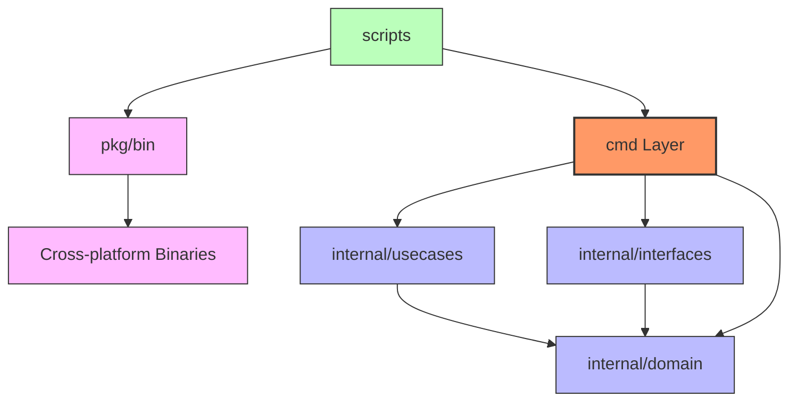

# プロジェクト設計仕様書

## 1. プロジェクト概要

### 1.1 プロジェクトの目的
`devbox`は開発者向けの包括的なユーティリティツール集合体です。様々なCLIツールとMCPを提供し、日常的な開発作業を効率化することを目的としています。

### 1.2 主要機能
- **CLIツール群**: コマンドラインユーティリティ
- **MCPサーバー群**: AI開発環境との統合を可能にする外部API連携サーバー
- **クロスプラットフォーム対応**: Linux、macOS、Windows環境での動作保証

### 1.3 技術スタック
- **言語**: Go
- **アーキテクチャ**: Clean Architecture
- **ビルドシステム**: Bash スクリプトベース

## 2. アーキテクチャ設計

### 2.1 設計思想
プロジェクトはClean Architectureの原則に基づいて設計されており、以下の特徴を持ちます：

- **関心の分離**: ビジネスロジック、インフラストラクチャ、プレゼンテーション層の明確な分離
- **依存関係の逆転**: 外部依存への抽象化によるテスタビリティの向上
- **単一責任原則**: 各コンポーネントが明確な責任を持つ設計
- **拡張性**: 新機能追加時の既存コードへの影響最小化

### 2.2 レイヤー構造



## 3. ディレクトリ構造詳細

### 3.1 cmd/ - エントリーポイント層
```
cmd/
├── cli/          # CLIツール群（69ツール、カテゴリ毎に整理）
│   ├── arithmetic-calculator/
│   ├── file-line-deduper/
│   ├── image-converter/
│   ├── ops-for-golang/
│   ├── ocr-executor/
│   └── ...
├── grpc/         # gRPCサーバーエントリーポイント
│   └── main.go
├── http/         # RESTサーバーエントリーポイント
│   └── main.go
├── mcp/          # MCPサーバー群
│   ├── router.go # MCPサーバールーティング
│   ├── arithmetic_calculator/
│   ├── brave_search/
│   ├── github/
│   └── ...
└── powershell/   # Windows PowerShell スクリプト
```

**責任範囲**:
- コマンドライン引数の解析
- 設定の初期化
- ユースケース層への処理委譲
- エラーハンドリングと出力制御
- HTTP/gRPCサービスの起動とハンドラ登録

### 3.2 internal/ - ビジネスロジック層
```
internal/
├── {tool_name}/
│   ├── domain/      # ドメインモデル・エンティティ
│   ├── usecases/    # ビジネスロジック・ユースケース
│   └── interfaces/  # 外部システムインターフェース
```

**各サブレイヤーの責任**:
- **domain/**: ビジネスルール、エンティティ、リポジトリインターフェース
- **usecases/**: アプリケーション固有のビジネスロジック
- **interfaces/**: 外部API、データベース、ファイルシステムとの連携

### 3.3 pkg/ - ビルド成果物管理
```
pkg/
├── bin/          # 実行可能バイナリ
│   ├── cli/      # CLIツールバイナリ
│   │   ├── linux_amd64/
│   │   ├── darwin_arm64/
│   │   └── win_amd64/
│   └── mcp/      # MCPサーバーバイナリ
│       ├── linux_amd64/
│       ├── darwin_arm64/
│       └── win_amd64/
├── bash/         # ビルド済みのBashユーティリティ
└── dos/          # Windows バッチファイル
```

**管理対象**:
- クロスプラットフォーム対応バイナリファイル
- Windows環境向けDOSバッチファイル
- デプロイメント用パッケージ

### 3.4 scripts/ - ビルド自動化
```
scripts/
├── build.sh                    # メインビルドスクリプト
├── build_mcp_tools.sh         # MCPツール専用ビルド
├── create_project_files.sh    # プロジェクト雛形生成
└── build_{tool_name}.sh       # 個別ツールビルド
```

**機能**:
- 統合ビルドプロセスの自動化
- クロスプラットフォームコンパイル
- 依存関係管理
- テスト実行とカバレッジ計測

---

*本仕様書は devbox プロジェクトの設計思想を記録したものです。プロジェクトの進化に合わせて継続的に更新されます。*
