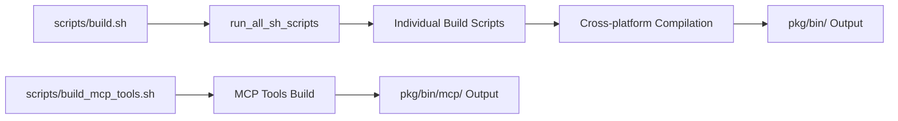

# ビルドガイド

`docs/tool_implementation/index.md` から切り出したビルド関連ガイドです。

## 1. CLIツール用ビルドスクリプト作成

下記のコマンドを実行することで、ビルドスクリプトが作成されます。
```bash
scripts/initialize/script_generator_to_build.sh {tool_name}
```

## 2. ビルド全体フロー概要



## 3. 主要ビルドスクリプト

**build.sh**
- 全ビルドスクリプトの統合実行
- Linux/AMD64、macOS/ARM64、Windows/AMD64対応のクロスプラットフォームビルド
- バイナリサイズ最適化（`-ldflags="-s -w" -trimpath`）
- エラーハンドリングと実行結果レポート
- スキップ機能による柔軟な実行制御

**build_mcp_tools.sh**
- MCPツール専用
- Linux/AMD64、macOS/ARM64、Windows/AMD64対応のクロスプラットフォームビルド
- バイナリサイズ最適化（`-ldflags="-s -w" -trimpath`）
