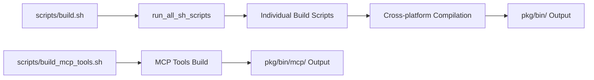

# cmd配下ツール実装・運用ガイド

`cmd/` 配下の実装作業に関する内容をまとめたものです。

## 関連ガイド

- 実装時の注意点・実装パターン: `docs/tool_implementation/implementation_guide.md`
- 実装/改修後のドキュメント更新手順: `docs/tool_implementation/documentation_guide.md`

## 4. MCPサーバーシステム

### 4.1 アーキテクチャ概要
MCPサーバーシステムは`cmd/mcp/router.go`を中心とした統一的なルーティングシステムを採用しています。

```go
// router.goの主要構造
func Router() {
  args := os.Args
  switch args[1] {
  case "arith_calc":
      arithmetic_calculator.BuildArithCalculatorServer()
  case "github":
      github.BuildGitHubServer()
  // ... その他のサーバー定義
  }
}
```

### 4.2 提供MCPサーバー一覧

[service_implementation_status.md](../project_status/service_implementation_status.md)を参照。

### 4.3 拡張パターン
新しいMCPサーバーを追加する際の標準的な手順：

1. `cmd/mcp/{server_name}/` ディレクトリ作成
2. `internal/{server_name}/` でビジネスロジック実装
3. `router.go` にルーティング追加
4. `scripts/build_{server_name}.sh` ビルドスクリプト作成

## 5. ビルドシステム

### 5.1 ビルドフロー概要


### 5.2 主要ビルドスクリプト

**build.sh**
- 全ビルドスクリプトの統合実行
- エラーハンドリングと実行結果レポート
- スキップ機能による柔軟な実行制御

**build_mcp_tools.sh**
- MCPツール専用のクロスプラットフォームビルド
- Linux/AMD64、macOS/ARM64、Windows/AMD64対応
- バイナリサイズ最適化（`-ldflags="-s -w" -trimpath`）

### 5.3 クロスプラットフォーム対応
```bash
# 例: MCPツールのマルチプラットフォームビルド
GOOS=linux GOARCH=amd64 go build -ldflags="-s -w" -trimpath -o "${LINUX_AMD64_DIR}/${output_name}" "${package}"
GOOS=windows GOARCH=amd64 go build -ldflags="-s -w" -trimpath -o "${WIN_AMD64_DIR}/${WIN_OUTPUT_NAME}" "${package}"
GOOS=darwin GOARCH=arm64 go build -ldflags="-s -w" -trimpath -o "${MAC_ARM64_DIR}/${output_name}" "${package}"
```

## 6. 主要CLIツール群

[service_implementation_status.md](../project_status/service_implementation_status.md)を参照。

## 7. 開発・運用指針

### 7.1 新機能追加手順
1. **要件定義**: 機能仕様とインターフェース設計
2. **既存実装の確認**: `docs/project_status/service_implementation_status.md`を参照し、重複実装を回避
3. **ディレクトリ作成**: `cmd/cli/{tool_name}` および `internal/{tool_name}`
4. **Clean Architecture実装**:
   - `internal/{tool_name}/domain/`: エンティティ・リポジトリインターフェース
   - `internal/{tool_name}/usecases/`: ビジネスロジック
   - `internal/{tool_name}/interfaces/`: 外部システム連携
   - `cmd/cli/{tool_name}/main.go`: エントリーポイント
5. **テスト実装**: TDD原則に基づくテストコード作成
6. **ビルドスクリプト作成**: `scripts/build_{tool_name}.sh`
7. **ドキュメント更新**: README.md および関連ドキュメントの更新

### 7.2 テスト戦略
- **単体テスト**: 各レイヤーの独立したテスト
- **統合テスト**: レイヤー間の連携テスト
- **カバレッジ目標**: 90%以上（`.clinerules`準拠）
- **テストコマンド**: `go test -v ./... -coverpkg=./... -covermode=count -coverprofile=coverage.out`
- **テストツール**: `github.com/stretchr/testify`, `github.com/DATA-DOG/go-sqlmock`

### 7.3 コード品質管理
- **命名規則**: Go標準に準拠（PascalCase、camelCase、snake_case）
- **コード整形**: `go fmt ./...` または `goimports` による自動整形
- **SOLID原則**: 設計原則の遵守
- **依存関係管理**: go.modによる明示的な依存関係管理
- **静的解析**: `go vet` などの標準ツールを活用

### 7.4 デプロイメント戦略
- **バイナリ配布**: クロスプラットフォーム対応バイナリの提供
- **バージョン管理**: セマンティックバージョニング
- **リリースプロセス**: 自動化されたビルド・テスト・パッケージング
