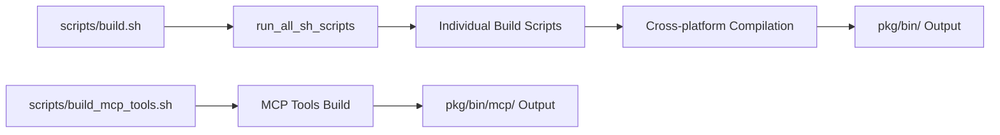

# cmd配下ツール実装・運用ガイド

`cmd/` 配下の実装作業に関する内容をまとめたものです。

## 関連ガイド

- 実装時の注意点・実装パターン: `docs/tool_implementation/implementation_guide.md`
- 実装/改修後のドキュメント更新手順: `docs/tool_implementation/documentation_guide.md`
- CLI実装ガイド: `docs/tool_implementation/cli/guide.md`
- MCP実装ガイド: `docs/tool_implementation/mcp/guide.md`
- サービス実装状況一覧: `docs/project_status/service_implementation_status.md`

## 1. 実装方式の選定（CLI / MCP）
1. **利用形態を決める**: 端末向け実行なら CLI、MCP クライアント連携なら MCP を選択
2. **既存実装を確認する**: `docs/project_status/service_implementation_status.md` を参照し、重複を回避
3. **参照ガイドを確定する**: CLI は `docs/tool_implementation/cli/guide.md`、MCP は `docs/tool_implementation/mcp/guide.md`

## 2. 共通実装フロー（CLI / MCP共通）
1. **要件定義**: 機能仕様、入出力、エラー設計を定義
2. **ディレクトリ作成**: `internal/{tool_name}` を作成して共通ロジックを配置
3. **レイヤー実装**: `domain/`、`usecases/`、`infrastructures/` を実装
4. **エントリーポイント実装**: CLI または MCP から `usecases` を呼び出す構成に統一
5. **テスト実装**: 単体テストと統合テストを追加
6. **ビルドスクリプト作成**: `scripts/build_{tool_name}.sh` を追加
7. **ドキュメント更新**: README と関連 docs を更新

## 3. CLI固有の実装手順
実装手順は `docs/tool_implementation/cli/guide.md` を参照。

## 4. MCP固有の実装手順
1. `cmd/mcp/{server_name}/` と必要なハンドラーを実装
2. `mcp.NewTool(...)` でツール定義（説明・必須パラメータ・型）を追加
3. 必須入力は `request.Require*`、任意入力は `request.Get*` で取得
4. 処理結果は `mcp.CallToolResult` として返却し、標準出力は使用しない
5. `cmd/mcp/router.go` にルーティングを追加

## 5. テスト戦略
- **単体テスト**: 各レイヤーの独立したテスト
- **統合テスト**: レイヤー間の連携テスト
- **CLI観点**: フラグ解析、標準出力、標準エラー出力、終了コード
- **MCP観点**: ツール定義、必須/任意パラメータ取得、`CallToolResult` 返却
- **カバレッジ目標**: 90%以上
- **テストコマンド**: `go test -v ./... -coverpkg=./... -covermode=count -coverprofile=coverage.out`
- **テストツール**: `github.com/stretchr/testify`, `github.com/DATA-DOG/go-sqlmock`

## 6. コード品質管理
- **命名規則**: Go標準に準拠（PascalCase、camelCase、snake_case）
- **コード整形**: `go fmt ./...` または `goimports` による自動整形
- **SOLID原則**: 設計原則の遵守
- **依存関係管理**: go.modによる明示的な依存関係管理
- **静的解析**: `go vet` などの標準ツールを活用

## 7. ビルドシステム

### 7.1 ビルドフロー概要


### 7.2 主要ビルドスクリプト

**build.sh**
- 全ビルドスクリプトの統合実行
- エラーハンドリングと実行結果レポート
- スキップ機能による柔軟な実行制御

**build_mcp_tools.sh**
- MCPツール専用のクロスプラットフォームビルド
- Linux/AMD64、macOS/ARM64、Windows/AMD64対応
- バイナリサイズ最適化（`-ldflags="-s -w" -trimpath`）

### 7.3 クロスプラットフォーム対応
```bash
# 例: MCPツールのマルチプラットフォームビルド
GOOS=linux GOARCH=amd64 go build -ldflags="-s -w" -trimpath -o "${LINUX_AMD64_DIR}/${output_name}" "${package}"
GOOS=windows GOARCH=amd64 go build -ldflags="-s -w" -trimpath -o "${WIN_AMD64_DIR}/${WIN_OUTPUT_NAME}" "${package}"
GOOS=darwin GOARCH=arm64 go build -ldflags="-s -w" -trimpath -o "${MAC_ARM64_DIR}/${output_name}" "${package}"
```

## 8. デプロイメント戦略
- **バイナリ配布**: クロスプラットフォーム対応バイナリの提供
- **バージョン管理**: セマンティックバージョニング
- **リリースプロセス**: 自動化されたビルド・テスト・パッケージング
